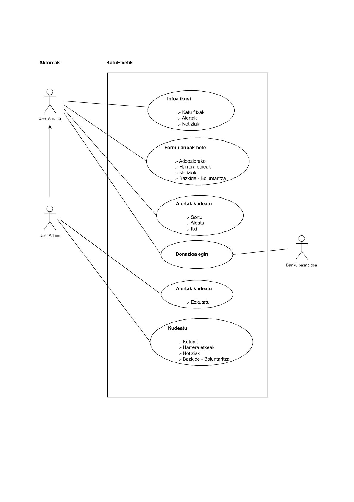
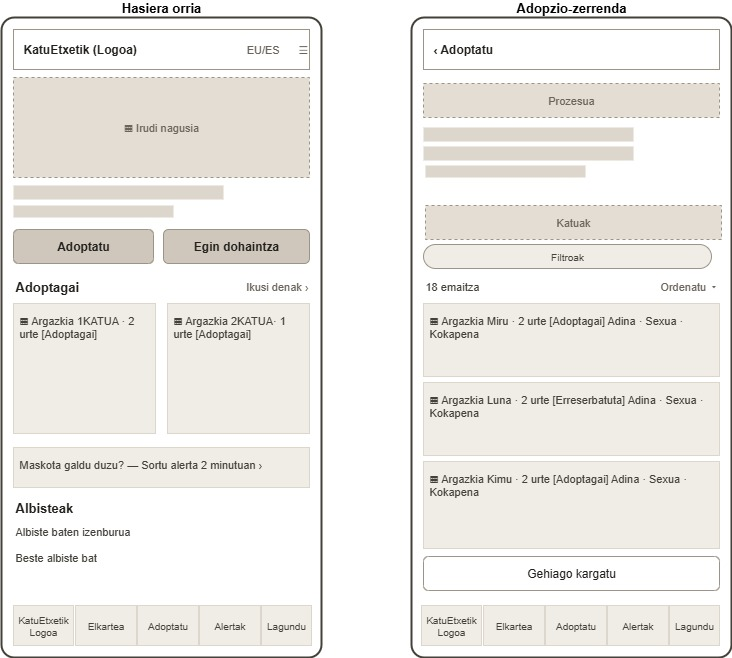
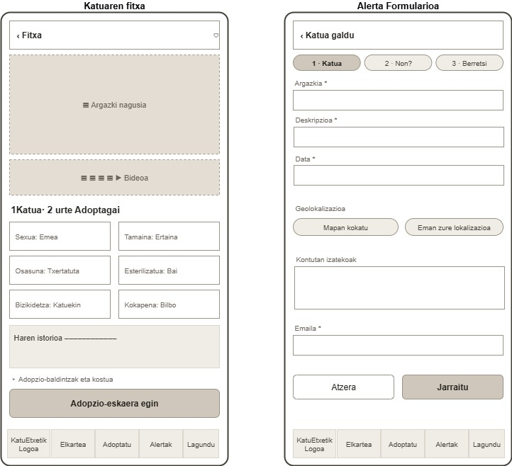
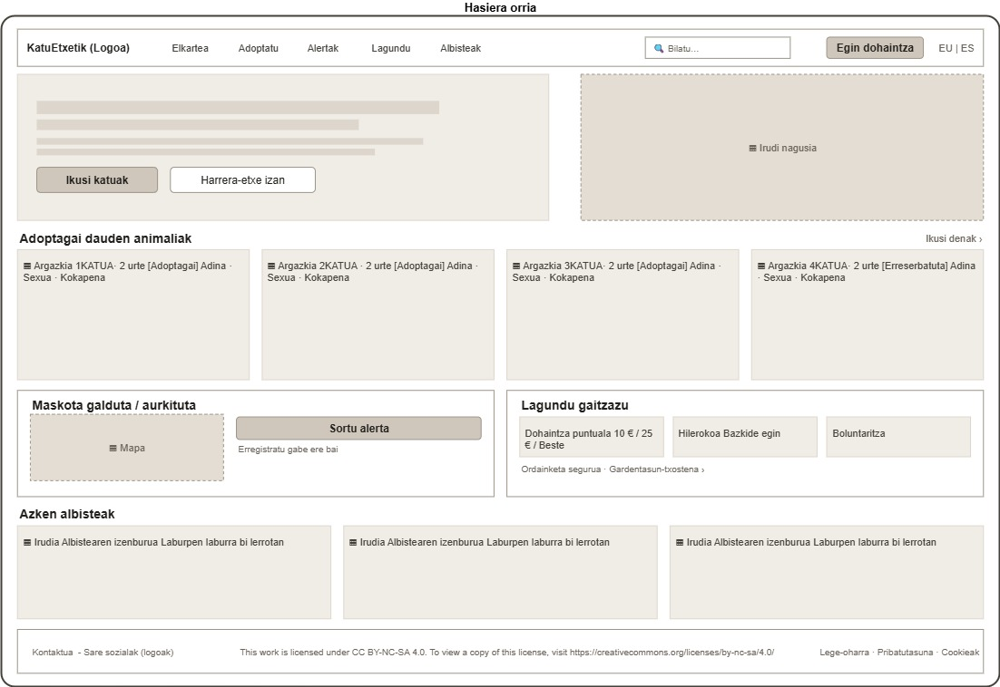
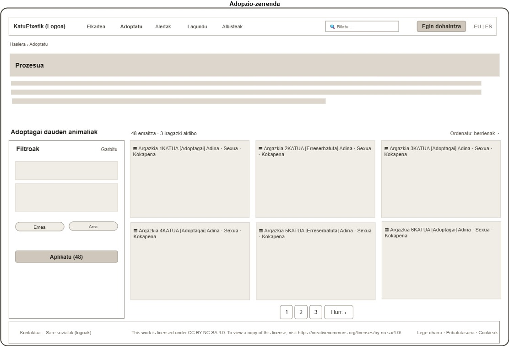
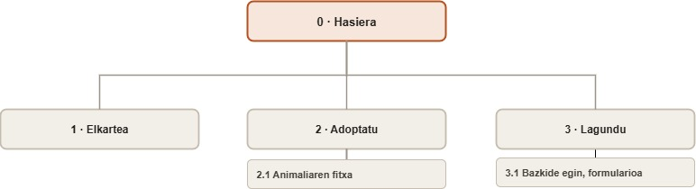

# KatuEtxetik
Animalien Babesleen Sarearen Webgunea

 

## Aurkibidea

1. [Sarrera](#1-sarrera)
2. [Benchmark](#2-benchmark)      
   2.1. [Ondorioak](#21-ondorioak)
3. [User profila](#3-user-profila)
4. [Krokisa](#4-krokisa)       
   4.1. [Mobila](#41-mobila) 
   4.2. [Eskritorioa](#42-eskritorioa)
5. [Nabigazio mapa](#5-nabigazio-mapa)
6. [Estilo gida](#6-estilo-gida)     
   6.1. [Koloreak](#61-koloreak)  
   6.2. [Tipografia](#62-tipografia)  
   6.3. [Ikonoak](#63-ikonoak)  
   6.4. [Botoiak](#64-botoiak)  
   6.5. [Irudiak](#65-irudiak)  

 

## 1. Sarrera

Repositorio honetan, **KatuEtxetik** , animaliak adoptatzeko, harrera-etxeak kudeatzeko eta galdutako maskotak lokalizatzeko atariaren diseinu proiektua jasoko da.
Dokumentu honetan berriz, atariaren aurre-diseinua jaso da, benchmark-a, erebiltzaile profilak, krokisak, mobil first kontuan izanik eta nabigazioa mapa jaso dira.

 

## 2. Benchmark

Sektoreko bost webgune aztertu dira, denak animalien babeserako erakundeenak, gure kasu-erabilera berdinekin (adopzioa, laguntza ekonomikoa, harrera-etxeak...). Nabigazioan, fitxetan, formularioetan, dohaintzan eta albisteetan arreta jarri da. Lan hau oso baliagarria izan da, jarraitu eta ekidin beharreko patroiak identifikatzeko.
Ondorengo webguneak aztertu dira:

- **Gipuzkoako Animalien Babeslea** : [https://protectoradegipuzkoa.com/eu](https://protectoradegipuzkoa.com/eu)
   - **Ona** : Elebiduna (eu/es) den webgune bakarra, garbia, intiutiboa, mugikorretik aritzeko eraginkorra da.
   - **Ahula** : Bazkide egiteko estekak ez du funtzionaten, ez dago galdutako animalientzako atalik.

- **Esperanza Felina** : [https://www.esperanzafelina.com/](https://www.esperanzafelina.com/)
   - **Ona** : Adoptados, Ellos no lo lograron, atalekin, katu bakoitzaren istorioa ezagutu al da (sarrera, tratamendua, bilakaera, adopzioa, ...) hau oso eragingarria de emozionalki eta komunitatea sortzeko.
   - **Ahula** : Mugikorretik aritzeko nekeza da.
     
- **Katubihotz** : [https://www.katubihotz.com/](https://www.katubihotz.com/)
   - **Ona** : Cangurocat, izeneko zerbitzua eskeintzen du. Norberak zaindu ezin dituenean katuak, hauen zaintzarako zerbitzua.
   - **Ahula** : Izena euskaraz baino orria gaztelera hutsean. Diseinu sinplea.

- **Adopciones La Granja de Labayru** : [https://www.adopcioneslagranja.com/](https://www.adopcioneslagranja.com/)
  - **Ahula** : Guztiz zaharkitutako webgunea. Egin behar ez denaren adibidea
    
- **Felinos Bilbao** : [https://felinosbilbao.org](https://felinosbilbao.org)
   - **Ona** : Dohaintza eskura, albisteak atala, animalien egoerari buruzko informazio sakona.
   - **Ahula** : Orria gaztelera hutsean.

### 2.1. Ondorioak

- KatuEtxetik webgunea, EAE eta Nafarroan zentratuko da, beraz elebitasuna izango du ardatz (eu/es).
- Animalien egoerari buruzko jarraipena burutuko da. Egoerak ezberdinduaz: Adoptagai, harreran, adoptatua.
- Dohaintza beti eskura jarriko da.
- Galdutako katuen atal desberdintzaile bat izango du. Aztertutako webgune batek ere ez du. Mapa geolokalizatu batekin  eta alerta publikoekin garatutakoa.
- Prozesuaren gardentasuna: Adopzioaren, harreraren eta dohaintzaren pausoak, baldintzak eta kostuak argi eta garbi azalduaz.
- Albisteak eta dibulgazio artikuluak jasoko dira.

 

## 3. User profila

Webgunera hurbilduko den erabiltzailea anitza izango da, adin eta egoera sozio-ekonomiko definitu gabeko pertsona konprometitua.
Bi profil nagusi identifikatu dira, lehena, erabiltzaile arrunta, webguneko bolumenaren zatirik handiena da, eta bigarrena berriz, administratzailea, webgunearen kudeaketaren arduradun nagusia.
Ondorengo irudian erabilera kasu diagrama jaso da profil bakoitzaren zereginak definituz:

 

## 4. Krokisa
Krokisa burutzean **Mobile first** izan da kontutan. Webgunearen erabilerarik ugariena mobil bidez izango dela uste bait da.
Ondorengo irudietan jaso da webguneak izango duen eskema, bertan ez dira kontutan izan ez kolore, ez tipografia, etab. Hauek estilo-gida eta prototipoan zehaztuko bait dira.

### 4.1. Mobila

Mobileko krokisa burutzen erabilgarritasuna izan da kontutan. Hasierako pantailan izango den hamburger menuaz gain, mobileko web orri guztitan beheko nabigazio barra iraunkor bat jartzea erabaki da.

Mobile prototipoa hasiera eta adopzio orrientzat:

Mobile prototipoa hasiera eta adopzio orrientzat:

### 4.2. Eskritorioa

Eskritorioan pantaila zabalera aprobetxatzen da, behin baino gehiagotan web orriak zutabetan ordenatuz.
Orri guztietan goiburu bera definitu da, logoa, menua, bilaketa, dohaintza eta hizkuntza aukerak ezarriz. Footerra ere berdina izango da orri guztietan.

Eskritorio prototipoa, hasiera:

Eskritorio prototipoa, adopzioa:

 

## 5. Nabigazio mapa

Webguneak hamalau orri izango ditu, hauek lau mailatan banatuko dira:

1. Maila: Hasiera orria.
2. Maila: Elkarte, adoptatu, alertak, lagundu, albisteak orriak
3. Maila: Animalien fitxa, alerta formularioa jakinarazpen berria, alerta formularioa egoera aldaketa, harrera etxea parte hartu formularioa, bazkidetza formularioa, ekarpena (banku pasabidea), boluntaritza formularioa.
4. Maila: adopzio formularioa.

Webgunearen antolaketa eta nabigazioaren parte bat definitu da ondorengo irudian:

Irudian adierazitako loturez gain kontutan izan behar dira eman daitezken lotura (nabigazio) horizontal guztiak, webguneko orri guztitan dauden goiburutik eta bai footeretik aldi oro eman bait daitezke nabigazio horizontalak.

 

## 6. Estilo gida
### 6.1. Koloreak 
### 6.2. Tipografia 
### 6.3. Ikonoak 
### 6.4. Botoiak 
### 6.5. Irudiak 
