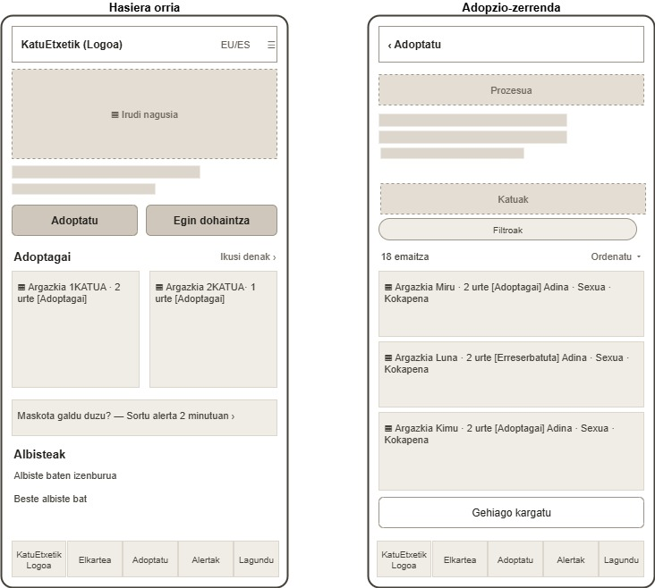
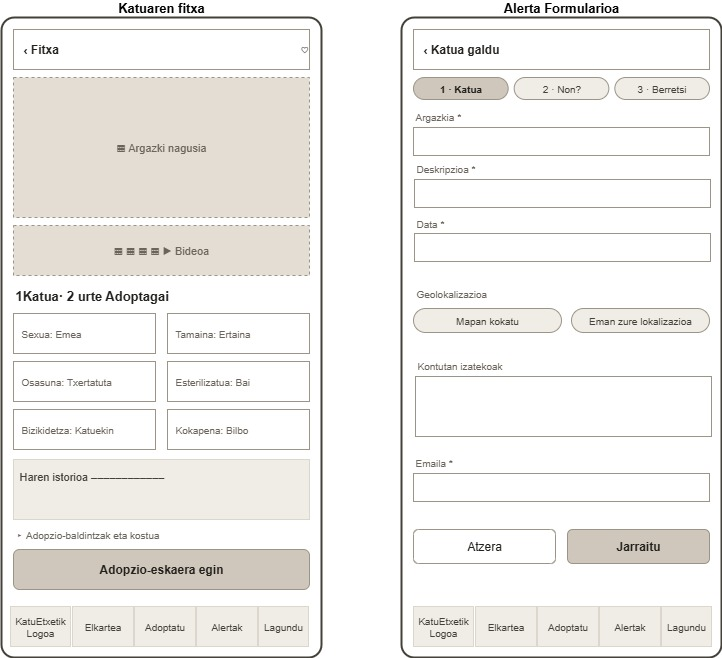
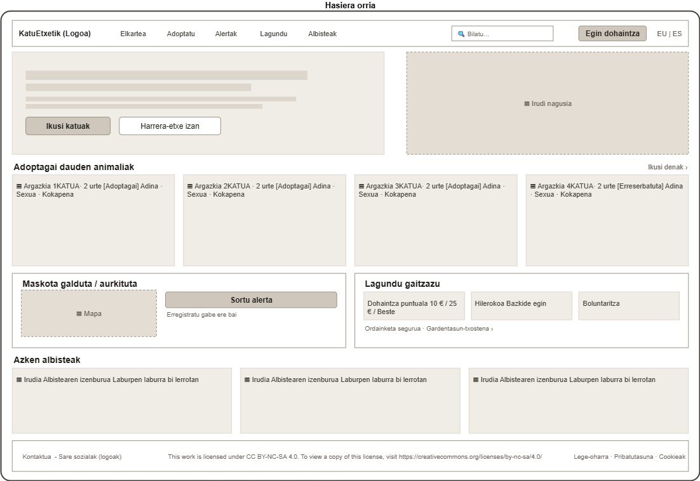
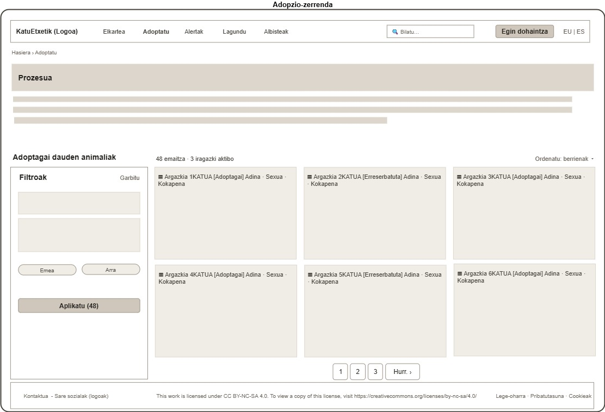
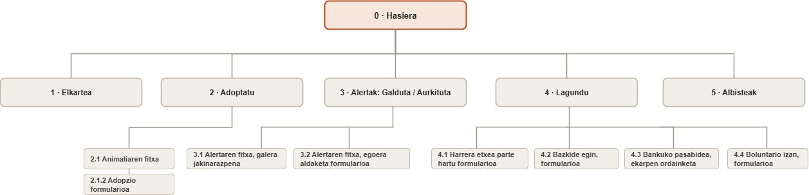
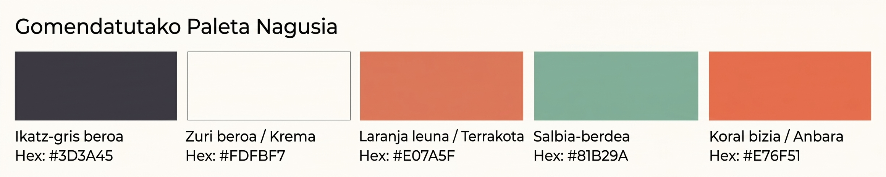
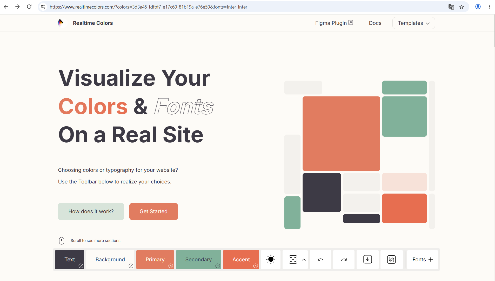

# KatuEtxetik
Animalien Babesleen Sarearen Webgunea

 

## Aurkibidea

1. [Sarrera](#1-sarrera)
2. [Benchmark](#2-benchmark)      
   2.1. [Ondorioak](#21-ondorioak)
3. [User profila](#3-user-profila)
4. [Krokisa](#4-krokisa)       
   4.1. [Mobila](#41-mobila) 
   4.2. [Eskritorioa](#42-eskritorioa)
5. [Nabigazio mapa](#5-nabigazio-mapa)
6. [Estilo gida](#6-estilo-gida)     
   6.1. [Koloreak](#61-koloreak)  
   6.2. [Tipografia](#62-tipografia)  
   6.3. [Ikonoak](#63-ikonoak)  
   6.4. [Botoiak](#64-botoiak)  
   6.5. [Irudiak](#65-irudiak)  

 

## 1. Sarrera

Repositorio honetan, **KatuEtxetik** , animaliak adoptatzeko, harrera-etxeak kudeatzeko eta galdutako maskotak lokalizatzeko atariaren diseinu proiektua jasoko da.
Dokumentu honetan berriz, atariaren aurre-diseinua jaso da, benchmark-a, erebiltzaile profilak, krokisak, mobil first kontuan izanik eta nabigazioa mapa jaso dira.

 

## 2. Benchmark

Sektoreko bost webgune aztertu dira, denak animalien babeserako erakundeenak, gure kasu-erabilera berdinekin (adopzioa, laguntza ekonomikoa, harrera-etxeak...). Nabigazioan, fitxetan, formularioetan, dohaintzan eta albisteetan arreta jarri da. Lan hau oso baliagarria izan da, jarraitu eta ekidin beharreko patroiak identifikatzeko.
Ondorengo webguneak aztertu dira:

- **Gipuzkoako Animalien Babeslea** : [https://protectoradegipuzkoa.com/eu](https://protectoradegipuzkoa.com/eu)
   - **Ona** : Elebiduna (eu/es) den webgune bakarra, garbia, intiutiboa, mugikorretik aritzeko eraginkorra da.
   - **Ahula** : Bazkide egiteko estekak ez du funtzionaten, ez dago galdutako animalientzako atalik.

- **Esperanza Felina** : [https://www.esperanzafelina.com/](https://www.esperanzafelina.com/)
   - **Ona** : Adoptados, Ellos no lo lograron, atalekin, katu bakoitzaren istorioa ezagutu al da (sarrera, tratamendua, bilakaera, adopzioa, ...) hau oso eragingarria de emozionalki eta komunitatea sortzeko.
   - **Ahula** : Mugikorretik aritzeko nekeza da.
     
- **Katubihotz** : [https://www.katubihotz.com/](https://www.katubihotz.com/)
   - **Ona** : Cangurocat, izeneko zerbitzua eskeintzen du. Norberak zaindu ezin dituenean katuak, hauen zaintzarako zerbitzua.
   - **Ahula** : Izena euskaraz baino orria gaztelera hutsean. Diseinu sinplea.

- **Adopciones La Granja de Labayru** : [https://www.adopcioneslagranja.com/](https://www.adopcioneslagranja.com/)
  - **Ahula** : Guztiz zaharkitutako webgunea. Egin behar ez denaren adibidea
    
- **Felinos Bilbao** : [https://felinosbilbao.org](https://felinosbilbao.org)
   - **Ona** : Dohaintza eskura, albisteak atala, animalien egoerari buruzko informazio sakona.
   - **Ahula** : Orria gaztelera hutsean.

### 2.1. Ondorioak

- KatuEtxetik webgunea, EAE eta Nafarroan zentratuko da, beraz elebitasuna izango du ardatz (eu/es).
- Animalien egoerari buruzko jarraipena burutuko da. Egoerak ezberdinduaz: Adoptagai, harreran, adoptatua.
- Dohaintza beti eskura jarriko da.
- Galdutako katuen atal desberdintzaile bat izango du. Aztertutako webgune batek ere ez du. Mapa geolokalizatu batekin  eta alerta publikoekin garatutakoa.
- Prozesuaren gardentasuna: Adopzioaren, harreraren eta dohaintzaren pausoak, baldintzak eta kostuak argi eta garbi azalduaz.
- Albisteak eta dibulgazio artikuluak jasoko dira.

 

## 3. User profila

Webgunera hurbilduko den erabiltzailea anitza izango da, adin eta egoera sozio-ekonomiko definitu gabeko pertsona konprometitua. Gazteak orokorrean esperientzia handiarekin hurbilduko dira webgunera, baino bada perfil helduago bat, webguneekiko harreman txikia izanik nahikoa ezezagutzarekin hurbilduko dena. Hori dela eta webgunea burutzean erabilgarritasuna kontu handian hartuko da.  
Erabiltzaileen artean bi profil nagusi identifikatu dira, lehena, erabiltzaile arrunta, webguneko bolumenaren zatirik handiena da, eta bigarrena berriz, administratzailea, webgunearen kudeaketaren arduradun nagusia.

 

## 4. Krokisa

Krokisa burutzean **Mobile first** izan da kontutan. Webgunearen erabilerarik ugariena mobil bidez izango dela uste bait da.
Ondorengo irudietan jaso da webguneak izango duen eskema, bertan ez dira kontutan izan ez kolore, ez tipografia, etab. Hauek estilo-gida eta prototipoan zehaztuko bait dira.

### 4.1. Mobila

Mobileko krokisa burutzen erabilgarritasuna izan da kontutan. Hasierako pantailan izango den hamburger menuaz gain, mobileko web orri guztitan beheko nabigazio barra iraunkor bat jartzea erabaki da.

Mobile prototipoa hasiera eta adopzio orrientzat:

Mobile prototipoa hasiera eta adopzio orrientzat:

### 4.2. Eskritorioa

Eskritorioan pantaila zabalera aprobetxatzen da, behin baino gehiagotan web orriak zutabetan ordenatuz.
Orri guztietan goiburu bera definitu da, logoa, menua, bilaketa, dohaintza eta hizkuntza aukerak ezarriz. Footerra ere berdina izango da orri guztietan.

Eskritorio prototipoa, hasiera:

Eskritorio prototipoa, adopzioa:

 

## 5. Nabigazio mapa

Webguneak sei orri izango ditu, hauek hiru mailatan banatuko dira:

1. Maila: Hasiera orria.
2. Maila: Elkarte, adoptatu, alertak, lagundu eta albisteak.
3. Maila: Animalien fitxa, alertaren fitxa (galera), alertaren fitxa (egoera aldaketa), harrera etxea parte hartu, bazkidetza formularioa, bankuko pasabidea, boluntaritza formularioa.
4. Maila: Adopzio formularioa.

Webgunearen antolaketa eta nabigazioaren parte bat definitu da ondorengo irudian:

Irudian adierazitako loturez gain kontutan izan behar dira eman daitezken lotura (nabigazio) horizontal guztiak, webguneko orri guztitan dauden goiburutik eta bai footeretik aldi oro eman bait daitezke nabigazio horizontalak.

 

## 6. Estilo gida

Estilo gida honetan, **KatuEtxetik** , animaliak adoptatzeko, harrera-etxeak kudeatzeko eta galdutako maskotak lokalizatzeko ataria burutzeko jarraituko diren arau eta gomendioak jasoko dira.
Bertan zehaztuko diren puntuak zehatz mehatz jarraitu beharko dira, web gune honetan ezer aportatu nahi bada.

### 6.1. Koloreak 

Katuak jaso, zaindu eta adoptatzeko webgune baterako, koloreen paletak, konfiantza, goxotasuna, lasaitasuna eta itxaropena transmititu behar ditu, tonu hotz edo erasokorrak saihestuz.
Hau kontuan izanik, kolore bat esleitzeko, gida honek gaiei lotutako ondorengo kolore-paleta proposatzen du: 

| Funtzioa      | Kolorea    |  Hex Kodea     |  Sentsazioa / Helburua     |
| :---          | :---       |     :----:     |  :---                      |
| **Atzeko plano nagusia** | Krema, zuri beroa  | #FDFBF7  | Goxoa, garbia eta zuri purua baino leunagoa begietara |
| **Kolore nagusia** | Laranja leuna, terrakota  | #E07A5F  | Beroa, goxotasuna eta katuen energia jostalaria gogorarazten ditu|
| **Bigarren mailako kolorea** | Salbia-berdea  | #81B29A  | Osasuna, ongizatea, natura eta itxaropena transmititzen ditu |
| **Testua eta egitura** | Ikatz-gris beroa  | #3D3A45  | Irakurgarritasun handia, beltz puruaren kontraste gogorrik gabe |
| **Ekintzarako deiak** | Koral bizia  | #E76F51  | Botoi nagusiak nabarmentzen ditu (Adoptatu, Eman dohaintza, Izan harrera-etxea) |

### 6.2. Tipografia 

Tipografiari dagokionez, web gune honetarako forma borobildu edo leunak dituen letra-tipo bat erabiliko da izenburuentzat, xarma eta irisgarritasuna transmititzeko. Eta sans-serif neutro bat testu-gorputzerako, katu fitxak eta beharrezko baldintzak erraz irakurri ahal izan daitezen. Konbinazio hauek Google Fonts-etik atera dira:

| Funtzioa      | Izenburu eta izenak    |  Testu-gorputza     |  Estiloa eta sentsazioa     |
| :---          | :---                   |     :----:          |  :---                       |
| **Beroa eta modernoa** | Nunito  | Inter edo Open Sans | Ertz leunduko letra-tipoak maitasuna helarazteko, testu garbi eta moderno batekin |
| **Narratiboa eta emotiboa** | Lora  | Nunito Sans  | Serif iturriak istorioak modu intimo eta editorialagoan kontatzen laguntzen du. Katuak galdu/bilatu...|
| **Hurbila eta Argia** | Rubik  | Roboto  | Egituratua, oso irakurgarria eta hurbila profesionaltasuna galdu gabe |

**Katuen fitxetan erabiltzeko irizpideak:**
- **Katuen izenak:** Izenburuko tipografia Bold (lodia) pisuarekin eta tamaina handian (gutxienez 24px - 32px) erabiliko da, fitxaren erdigunea izan dadin.

- **Datu teknikoak (Adina, Sexua, Izaera, Osasuna):** Testu-gorputzeko iturria tamaina estandarrean (16px), etiketei Bold aplikatuz (adib., Izaera: Beldurti samarra baina oso goxoa) erabiliko da.

- **Lerrorarteko tartea:** Linearen altuera (line-height) 1.5 eta 1.6 artean egokituko da testu-gorputzean, istorio luzeak erraz irakurri ahal izateko.

- **Irakurgarritasuna botoietan:** Terrakota edo koral koloredun botoietan, letra zuria eta SemiBold edo Bold pisuarekin erabiliko da, kontraste egokia bermatzeko.

### 6.3. Ikonoak 

Webguneak itxura profesionala, atsegina eta irisgarria izateko, ikonoek irizpide hauek bete behar dituzte:

- **Estilo-koherentzia bateratua:**

   - Webgune osoan, ikono familia bera erabiliko da.

   - Ertz borobildudun ikonoak erabiliko dira, tipografiarako gomendatutako estiloarekin bat egiteko.

- **Argitasuna eta intuitibotasuna:**

   - Ikonoa berez ulertu behar da.
  
- **Formatua, SVG nahitaez:**

   - SVG formatua (PNG edo JPG-ren ordez) erabiliko da. SVG fitxategiek ez dute kalitaterik galtzen pantaila handietan, oso gutxi pisatzen dute eta CSS bidez kolorea erraz aldatzeko aukera ematen dute.

- **Kolore-armonia:**

   - Erabili kolore bakarreko ikonoak, aurreikusitako paletako tonuak erabiliz: ikatz-grisa (#3D3A45), salbia berdea (#81B29A) edo terrakota (#E07A5F).

- **Irisgarritasuna:**

   - Botoietan edo katuen fitxetan ikonoak jartzean, kontraste nahikoa izan behar dute atzealdearekin.

   - Ikusmen-desgaitasuna duten pertsonentzat pantaila-irakurleek ikonoa irakurtzeko, ikono bakoitzak bere aria-label edo alt atributua izatea beharrezkoa da.

Aurreko atalean definitutako tipografia kontuan izanik, webguneko ikonoek ondorengo tamaina izan beharko dute. Horrela, testuaren eta ikonoaren arteko oreka bisuala lortuko da:

- **16px testurako,** ikono-tamaina: 20px × 20px (edo gehienez 24px × 24px).

- **24 - 32px testurako,** ikono-tamaina: 28px × 28px (edo gehienez 32px × 32px).

### 6.4. Botoiak 

- **Botoi-hierarkia eta koloreak:**

| Botoi mota      | Kolorea    |  Textuaren kolorea     |  Erabilera     |
| :---          | :---       |     :----:     |  :---                      |
| **Nagusia** | Koral bizia (#E76F51)  | Zuria (#FFFFFF)  | Webguneko ekintza garrantzitsuenetarako (adopzioa, dohaintza,...) |
| **Bigarren mailakoa** | Salbia Berdea (#81B29A)  | Zuria (#FFFFFF) edo Ikatz-grisa (#3D3A45)  | Bigarren mailako ekintzetarako (fitxa ikusi, iragazi, harrera-informazioa)|
| **Premiazkoa** | Terrakota (#E07A5F)  | Zuria (#FFFFFF)  | Premiazko harrera-etxeak edo kasu larriak nabarmentzeko |
| **Ezgaitua (Disabled)** | Gris Argia (#E0E0E0)  | Ikatz-grisa (#3D3A45)  | Adib: Formularioan nahitaezko datuak bete gabe daudenean |

- **Botoien tamainak eta neurri teknikoak:**

| Tamaina        | Altuera       |  Padding-a                     |  Testu-tamaina     |
| :---           | :---          |     :----:                     |  :---              |
| **Handia(L)** | 48px – 52px  | 14px goian/behean, 28px alboetan  | 18px (SemiBold) |
| **Ertaina(M)** | 40px – 44px  | 10px goian/behean, 20px alboetan | 16px (SemiBold) |
| **Txikia(S)** | 32px – 36px  | 6px goian/behean, 14px alboetan | 14px (Medium) |

- **Estiloa, forma eta tipografia:**
  
   - Botoien ertza borobildua izango da (border-radius): 8px eta 12px artean. Ertz borobilduak goxoagoak eta hurbilagoak dira.

   - Ikonoak botoietan: Botoi nagusietan ikono bat jartzen bada, testuaren ezkerrean jarri behar da, 8px-ko tartearekin (gap: 8px).

- **Interaktibitatea (Micro-interactions):**

Botoi batek bizia dela erakutsi behar du sagua gainetik pasatzean edo sakatzean:

   - Hover (sagua gainean dela): Kolorea %10 ilundu eta botoia 2px igotzea itzal leun bat gehituz.

   - Active (sakatzean): Botoia 1px beherantz sakatu dela simulatuko da.

### 6.5. Irudiak 

Katuen adopzio webgune batean, hauen argazkiek emozioa piztu eta konfiantza helarazi behar dute, horretarako, argi naturala eta tonu beroak erabiliko dira argazkitan, koloretan bezala hotzak sahiestuaz. Hala nola, giro etxekoia, pertsonalizazioa, duintasuna eman beharko zaie argazki hauei.

- **Erabilgarritasunari** dagokionez:
  
   - Webp edo AVIF formatuan landuko dira irudiak. JPG edo PNG formatuen kalitate bera eskaitzen dute, baina pisu gutxiagorekin.

   - Irudiek gutxi okupatu behar dute (100 - 150 KB). Webguneak 2 segunduren azpitik kargatu behar du mugikorretan.

   - Resoluzioa ere zaindu behar da pantailetan ikusteko balio estandarra erabiliz.

- **Irisgarritasunari** dagokionez berriz:

     - Pantaila-irakurleak erabiltzen dituzten pertsonentzat zein Google-n kokatzeko, argazki bakoitzak deskribapen testua (alt) izan behar du.
